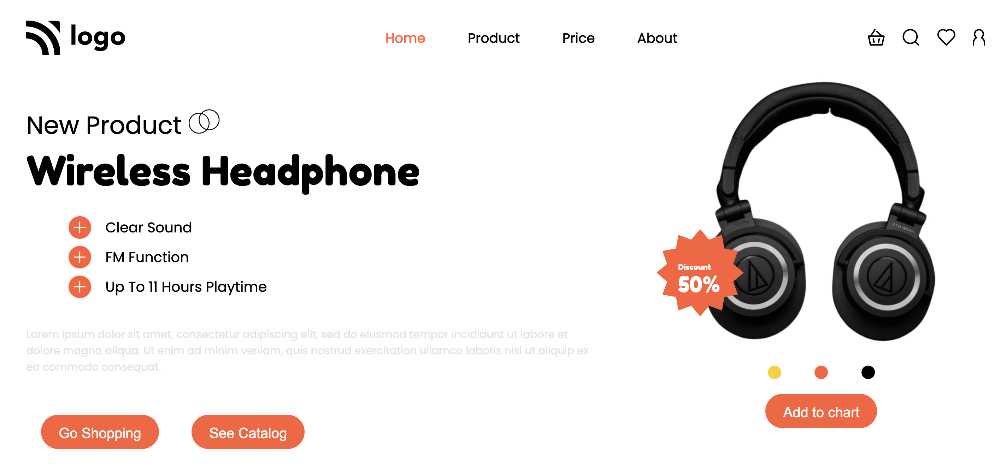

**Product Homepage**
--------------------------------------
-----------------------------------------
   

[Deployed Link](https://product-homepage-by-hs.netlify.app/)

What I learned from this Project?

- Learned how to use **HTML** and **CSS** to create a beautiful website.
- Learned building Navbar using CSS Flexbox.
- Used CSS positioning property.
- Learned and implemented class, tag based selection of HTML elements.
- Learned to implement media queries to make the webpage responsive for other devices too.

